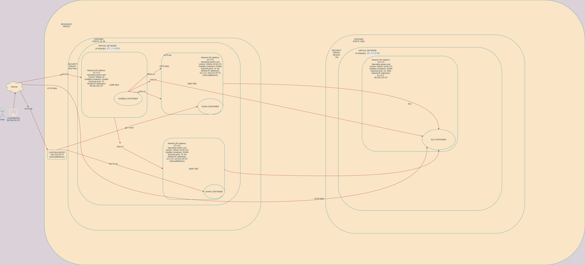
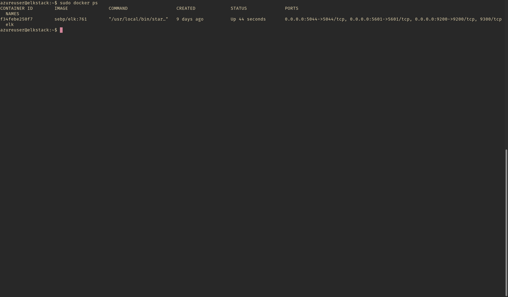

## Automated ELK Stack Deployment

The files in this repository were used to configure the network depicted below.

These files have been tested and used to generate a live ELK deployment on Azure. They can be used to either recreate the entire deployment pictured above. Alternatively, select portions of the yml file may be used to install only certain pieces of it, such as Filebeat.

  - filebeats-playbook.yml

This document contains the following details:
- Description of the Topology
- Access Policies
- ELK Configuration
  - Beats in Use
  - Machines Being Monitored
- How to Use the Ansible Build

### Description of the Topology

The main purpose of this network is to expose a load-balanced and monitored instance of DVWA, the "Damn Vulnerable Web Application".

Load balancing ensures that the application will be highly reliable, in addition to restricting direct access to the network. The load balancer protects the **availability** of these webservers, and the use of a *Jump Box* facilitates the management of access to these webservers. Really, the Jump Box allows us to implement effective network security policies, but the drawback is that the Jump Box becomes a single point of failure.

Integrating an ELK server allows users to easily monitor the vulnerable VMs for changes to the logs and system files. The Beat in use here is Filebeats.

The configuration details of each machine may be found below.

| Name     | Function | IP Address | Operating System |
|----------|----------|------------|------------------|
| Jump Box | Gateway  | 10.1.0.4   | Debian 10        |
| ONE-WEB  | Webserver| 10.1.0.5   | Ubuntu server 18 |
| TWO-WEB  | Webserver| 10.1.0.6   | Ubuntu server 18 |
| ELKSTACK | Monitor  | 10.2.0.4   | Ubuntu server 18 |

### Access Policies

The machines on the internal network are not exposed to the public Internet. 

Only the **Jump Box** machine can accept SSH connections from the Internet. Access to this machine is only allowed from the following IP addresses:
- 98.156.216.137

Machines within the network can only be accessed by **Jump Box**.

A summary of the access policies in place can be found in the table below.

| Name     | Publicly Accessible | Allowed IP Addresses |
|----------|---------------------|----------------------|
| Jump Box | Yes                 | 98.156.216.137       |
| ONE-WEB  | No                  | 10.1.0.4 10.2.0.4    |
| TWO-WEB  | No                  | 10.1.0.4 10.2.0.4    |
| ELKSTACK | No                  | 10.1.0.4             |

### Elk Configuration

Ansible was used to automate configuration of the ELK machine. No configuration was performed manually, which is advantageous because the process can be easily automated.
Thus it can be extened so that many instances can be deployed.

The playbook implements the following tasks:
- _TODO: In 3-5 bullets, explain the steps of the ELK installation play. E.g., install Docker; download image; etc._
- Install docker.io and python depencencies
- Increase the virtual memory allocated to the container
- Download then start the `sebp/elk:761` container image.

The following screenshot displays the result of running `docker ps` after successfully configuring the ELK instance.

### Target Machines & Beats
This ELK server is configured to monitor the following machines:
- 10.1.0.5 (ONE-WEB)
- 10.1.0.6 (TWO-WEB)

We have installed the following Beats on these machines:
- FileBeats

These Beats allow us to collect the following information from each machine:
logging information on the systems (e.g. failed sudo attempts) and information regarding both access to and modification of sensitive files on the system (e.g. `/etc/shadow`)

### Using the Playbook
In order to use the playbook, you will need to have an Ansible control node already configured. Assuming you have such a control node provisioned: 

SSH into the control node and follow the steps below:
- Copy the `install-elk.yml` file to `/etc/ansible/playbooks`.
- Update the `hosts` file to include an `[elk]` group where the content looks
something like this `azureuser@10.2.0.4 ansible_python_interpreter=/usr/bin/python3`; it's going to be the group on which the `install-elk.yml` playbook will be run.
- Run the playbook, and navigate to `http://http://[elk-public-ip]:5601/app/kibana` to check that the installation worked as expected.

